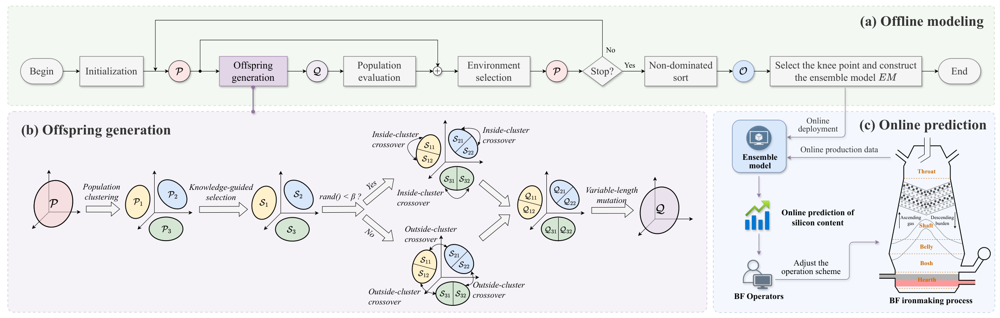

# CL-MOEEL: Closed-loop Multiobjective Evolutionary Ensemble Learning



This is the code implementation for the paper: [*Silicon Content Prediction in Blast Furnace Ironmaking Process Based on Closed-loop Multiobjective Evolutionary Ensemble Learning*](xxx) (Accepted by IEEE TIM).

This public GitHub repository contains:

+ [x] All source code related to our proposed algorithm;

+ [x] The benchmark dataset files (Residential Building Data set): `data/Residential Building Data Set/Residential-Building-Data-Set-preprocessed.xlsx`;

+ [x] The practical industrial dataset files (Silicon Content Prediction Data Set): `data/Silicon Content Prediction Data Set/Si_predict.xlsx`;

**Note:** Some code is inspired by [jMetalPy](https://github.com/jMetal/jMetalPy). A paper introducing jMetalPy is available at: [*jMetalPy: A Python framework for multi-objective optimization with metaheuristics*](https://doi.org/10.1016/j.swevo.2019.100598).

## Locations of Modules for the Proposed CL-MOEEL in the Project Files

+ **Proposed CL-MOEEL Algorithm**: `core/algorithm/moeec_nsgaii.py`, class name: `MOEEC_NSGAII_v5`;
+ **Proposed Variable-Length Encoding Scheme**: `core/problem/solution.py`;
+ **Proposed Knowledge-Guided Selection (KGS) Method**: `core/algorithm/moeec_nsgaii.py`, lines 205–277;
+ **Two Proposed Variable-Length Crossover Operators (inside-cluster crossover and outside-cluster crossover)**: `core/algorithm/moeec_nsgaii.py`, lines 364–443;
+ **Precomputation Technique (to reduce the algorithm's time complexity)**: `core/problem/ensemble_model.py`, located in the `MultiKernelTransformer` class.

## Test CL-MOEEL on Benchmark Dataset & Practical Industrial Dataset

### Step 1. Run algorithm

```powershell
python "scripts/run_moeec_nsgaii_v5_kfold.py" --dataset=""
```

+ `--dataset`: the dataset name, e.g., "UCI14_ResidentialBuilding" (benchmark dataset ), or "Si_predict" (practical industrial dataset).

### Step 2. Process results

```powershell
python "scripts/processing_results_kfold.py" --dataset="" --path=""
```

+ `--dataset`: the dataset name, e.g., "UCI14_ResidentialBuilding" (benchmark dataset ), or "Si_predict" (practical industrial dataset).

+ `--path`: the result path, e.g., "MOEEC_NSGAII_v5_[year]-[month]-[day]_kfold", where "[year]-[month]-[day]" is the time stamp of the folder. Note that this name will be automatically generated after running the script "run_moeec_nsgaii_v5_kfold.py".

After running the above command, two result files, "results.csv" and "inds.csv" , will be generated in the directory specified by the `--path` parameter. The "results.csv" file contains detailed records of all metrics (e.g.,  RMSE, $R^2$, HR, Runtime) for the five-fold cross-validation across each repeat experiment, including results for each fold. The "inds.csv" file records the average results of the five-fold cross-validation across all repeat experiments.

## Test CL-MOEEL on Your Own Dataset

### Step 1. Creat a custom dataset class

Create a new script in the "core/dataset/" directory, defining your own dataset class (which should inherit from the `MyDatasetKFold` class), and import the newly defined class name in the `__init__.py` file.

### Step 2. Run CL-MOEEL and process results

Execute the following command to run the algorithm and process the experimental results.

```powershell
# run algorithm
python "scripts/run_moeec_nsgaii_v5_kfold.py" --dataset=""

# process results
python "scripts/processing_results_kfold.py" --dataset="" --path=""
```

Note that the dataset parameter (`--dataset`) should be changed to the name of your defined dataset class, and the algorithm results will be saved in the "models/" directory. After processing the results, the evaluation metrics (RMSE, $R^2$, HR, Runtime) will be computed and saved in "inds.csv" in the same directory.

### Citation

If you find our work useful, please cite our paper:

> ```latex
> @article{xxx,
> author = {xxx},
> title = {xxx},
> year = {xxx},
> publisher = {xxx},
> url = {xxx},
> doi = {xxx},
> journal = {xxx}
> }
> ```
